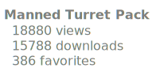
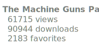

# I make mods for Scrap Mechanic

# My popular mods:

        <a href="https://github.com/Vajdani/SM-Manned-Turret-Pack" target="_blank">
                
                <a href="https://steamcommunity.com/sharedfiles/filedetails/?id=3107290429" target="_blank">
                        
                        
                </a>
        </a>
        <a href="https://github.com/Vajdani/SM-Laser-Tools" target="_blank">
                
                <a href="https://steamcommunity.com/sharedfiles/filedetails/?id=2843905833" target="_blank">
                        
                        
                </a>
        </a>
        <a href="https://github.com/RaftMechanic/Raft-Mechanic-Game-Mode" target="_blank">
                
                <a href="https://steamcommunity.com/sharedfiles/filedetails/?id=2807590049" target="_blank">
                        
                        
                </a>
        </a>
        <a href="https://github.com/DriVVer/TheMachineGunPack" target="_blank">
                
                <a href="https://steamcommunity.com/sharedfiles/filedetails/?id=1903792337" target="_blank">
                        
                        
                </a>
        </a>

